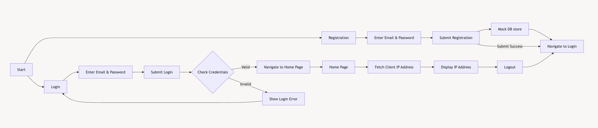

# Multistage Dockerfile Practice 

## Creation of a simple react-app
- `/` for this route a simple login interface
- `/register` for this route a simple registraion interface
- `/home` for this a simple home page after successfully loggedin

## Userflow Diagram


## Command Used To build the `Dockerfile`

```bash
docker build -t react-app:v1.0 . --no-cache 
```
## Docker Image Size after building the image
